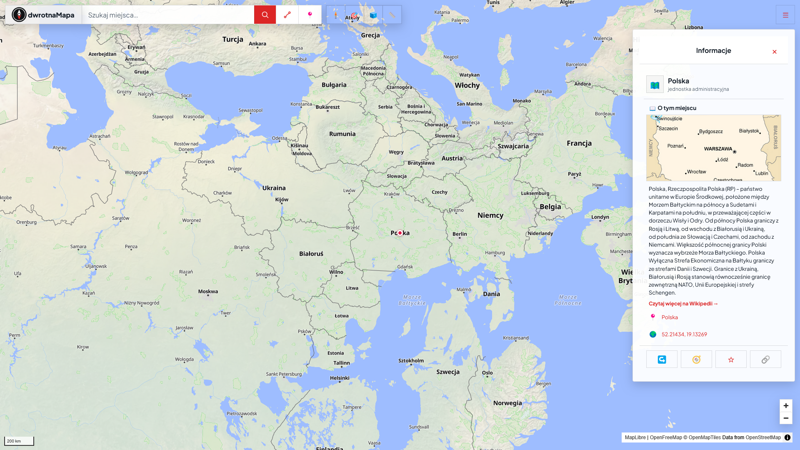
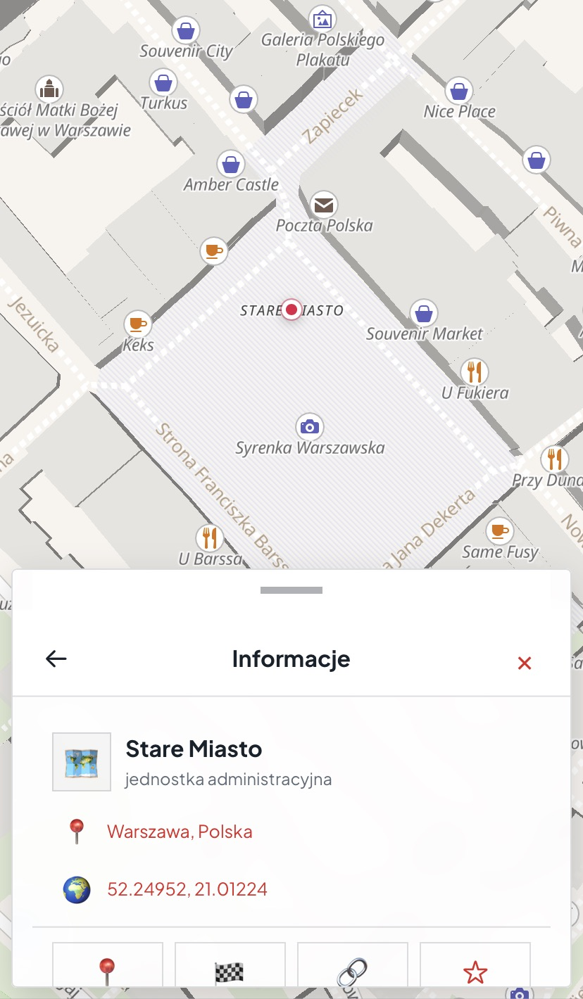
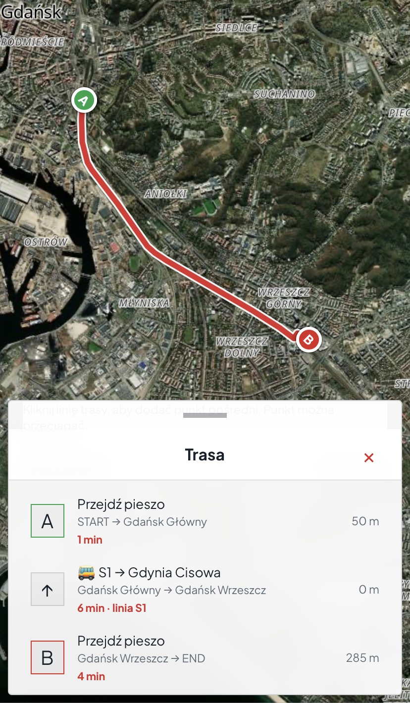
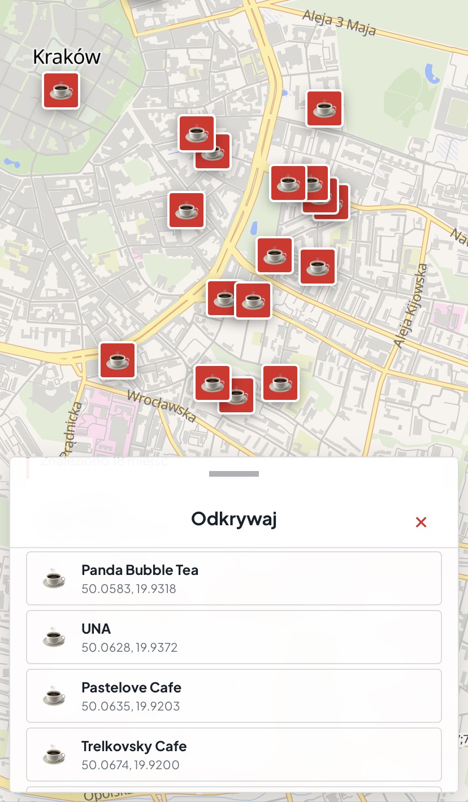
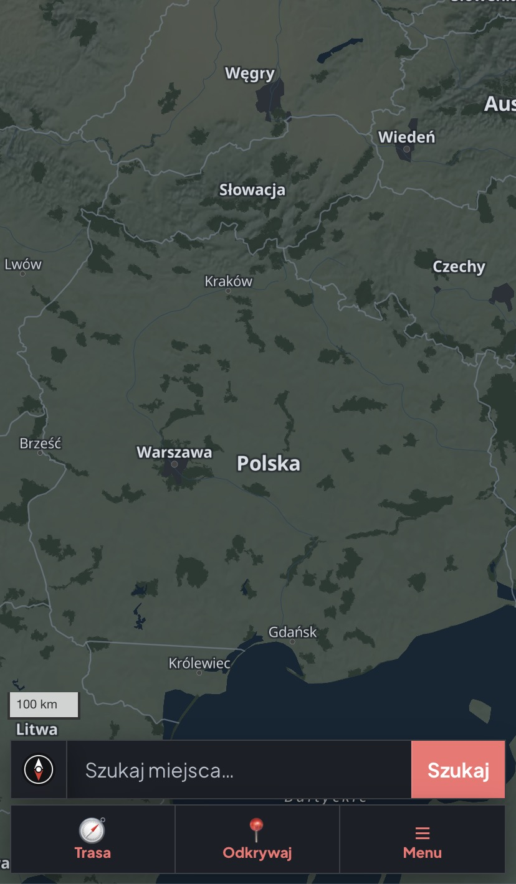
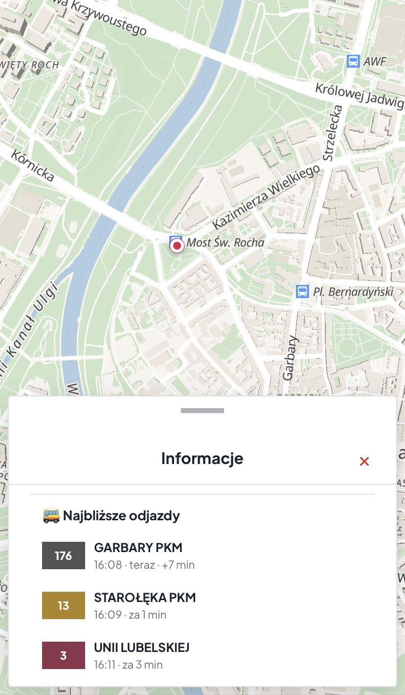
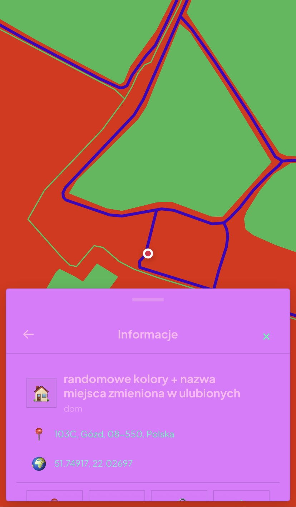

# <a href="https://odwrotnamapa.pl/">Odwrotna Mapa</a>

**Odwróć swój standard myślenia o mapach**

---
Apki (Wersja Beta): https://github.com/odwrotnamapa/OdwrotnaMapa/releases/tag/v1.0

# 🇵🇱 O projekcie
Większość współczesnych map przedstawia północ na górze, więc łatwo zapomnieć, że nie jest to prawo natury, lecz historyczna konwencja. **Odwrotna Mapa** zachęca do spojrzenia na świat z innej perspektywy — i to dosłownie — oraz przypomina, że sposób przedstawiania rzeczywistości znacząco wpływa na to, jak ją postrzegamy.

...jednak skłamałbym mówiąc, że to jedyne co definiuje tę apkę  —  jest z niej znacznie więcej pożytku i multum funkcjonalności, między innymi:
- **Wyszukiwarka miejsc i adresów** (Nominatim, Photon)
- **Odkrywaj** — szybkie wyszukiwanie w kategoriach (restauracje, kawiarnie, apteki, przystanki i inne)
- **Ulubione miejsca** — zapis dowolnego punktu na mapie z własną nazwą i notatką
- **Wyznaczanie tras** — pieszo, rowerem, samochodem i komunikacją miejską (z rozkładami odjazdów na przystankach)
- **Widok satelitarny**
- **Własne motywy kolorystyczne** — pełna personalizacja kolorów mapy (woda, zieleń, budynki, drogi) i interfejsu, plus tryb automatyczny podążający za ustawieniem systemu (jasny/ciemny)
- **Kopia zapasowa** — eksport/import ustawień (ulubione, kolory) do pliku JSON, z wyborem co dokładnie eksportować
- **Dwa języki** — polski i angielski
- **Aplikacje na Androida, Windowsa i Linuxa** (beta), oprócz wersji przeglądarkowej
- W pełni otwarty kod źródłowy (licencja MIT)

# 🇬🇧 About the project
Most modern maps place north at the top. This is not, however, the only possible way to represent the world. **Odwrotna Mapa** (literally "Reverse Map") was created as an attempt to look at a familiar map from another perspective and to encourage reflection on how conventions influence our perception of reality.

...but I'd be lying if I said that's the only thing that defines this app — it offers much more value and a wealth of features, including:
- **Place and address search** (Nominatim, Photon)
- **Discover** — quick category-based search (restaurants, cafes, pharmacies, bus stops, and more)
- **Favorite places** — save any point on the map with a custom name and note
- **Route planning** — walking, cycling, driving, and public transit (with departure times at stops)
- **Satellite view**
- **Custom color themes** — full personalization of map colors (water, greenery, buildings, roads) and UI, plus an automatic mode that follows the system's light/dark setting
- **Backup** — export/import settings (favorites, colors) as a JSON file, with control over what exactly to include
- **Two languages** — Polish and English
- **Android, Windows and Linux apps** (beta), in addition to the browser version 
- Fully open source (MIT license)

---
# Zrzuty ekranu

---
📨 Kontakt:
odwrotnamapa@protonmail.com

☕️ Buy Me a Coffee:
https://buymeacoffee.com/odwrotnamapa

🪙 Bitcoin:
bc1qk4ef9ssyt5tjw2c0xrp8w5sthuwp9vw9acc96t
